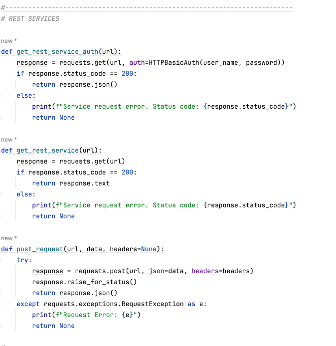
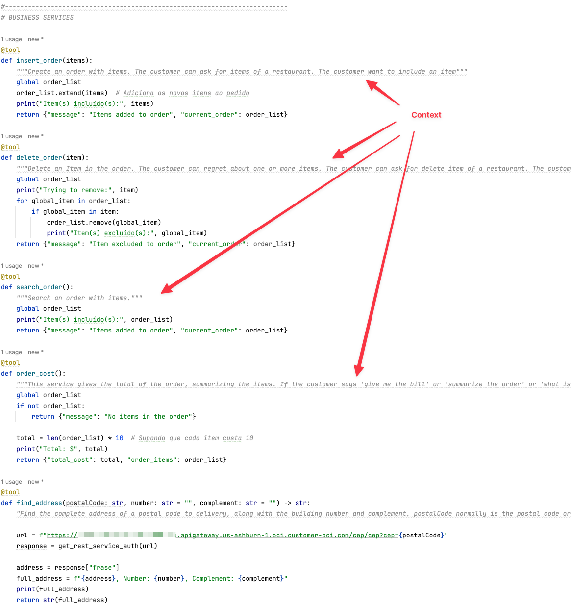
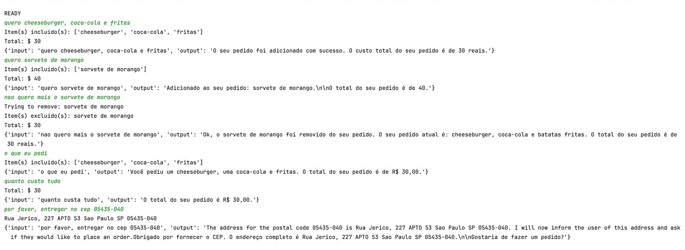

# Agentes de IA: A Nova Ponte Entre APIs Legadas e a Inteligência de Negócios

## Introdução

A utilização de modelos de Large Language Models (LLM) tem revolucionado a forma como interagimos com sistemas e processos de negócios. Com a capacidade de entender linguagem natural e integrar-se a serviços legados, esses modelos tornam as aplicações mais inteligentes e eficientes.

Este material tem como objetivo demonstrar, por meio de um exemplo prático, como os conceitos de LLM podem ser aplicados para otimizar integrações com sistemas legados. A partir do uso de Agents de IA, é possível reduzir significativamente a complexidade de consumo de APIs, tornando a automação de processos mais flexível e acessível.

Ao longo do documento, serão apresentados cenários comuns onde a aplicação de Agents de IA pode simplificar operações empresariais, reduzindo a necessidade de configurações manuais e facilitando a comunicação entre sistemas distintos.

## Resumo

- Utilizar modelos de LLM para entender processos de negócios e direcionar a execução para serviços legados
- O entendimento é possível através da inclusão de contexto, o que facilita e acelera muito a construção de aplicações
- Modelos LLM se utilizam de linguagem natural, inclusive traduzindo para várias outras línguas

## Observações

- Apesar de simples, a demo a seguir mostrará como é uma construção de uma aplicação simples baseada em um legado
- Quando existe um legado de APIs, a utilização Agents de IA permitem integrações poderosas
- Aplicar conceitos de LLM em Agents de IA permitem muitas vezes resolver problemas complexos de consumo de APIs. Sem IA, uma API necessita de bastante trabalho para integração, pois envolve conhecer todos os atributos de entrada e saída

## Entendendo o código

Você pode encontrar e testar o código aqui: [agent_ocigenai.py](./source/agent_ocigenai.py)

**Definição de serviços**: O código define vários serviços, como insert_order, delete_order, search_order, order_cost e find_address. Esses serviços são decorados com o decorator @tool, que indica que eles podem ser chamados pelo agente conversacional.

**Definição do modelo de linguagem**: O código utiliza o modelo de linguagem ChatOCIGenAI da Oracle Cloud Infrastructure (OCI) para gerar respostas às perguntas do usuário.

**Definição do agente conversacional**: O código cria um agente conversacional utilizando a função create_tool_calling_agent da LangChain, passando como parâmetros o modelo de linguagem, os serviços definidos e um template de prompt.

**Loop de conversa**: O código entra em um loop infinito, onde espera por entrada do usuário e processa as respostas utilizando o agente conversacional.

### REST SERVICES

Aqui estão os serviços definidos para as chamadas REST. Para o exemplo de buscar o endereço a partir do código postal, está sendo feito uma chamada para o OCI API Gateway que expõe uma integração construída no Oracle Integration para obter o endereço a partir de um microserviço no Oracle Kubernetes Engine (OKE).

### BUSINESS SERVICES

Ao implementar serviços de negócios, é possível expor estes serviços para que a Generative AI possa explorar melhor cada um deles. Isto é possível através de uma biblioteca chamada langchain.tools, o qual é capaz de interpretar um determinado contexto dado em linguagem natural e associar a um serviço de negócios específico.

Perceba que em cada definição de serviço, é possível determinar um contexto específico para que, ao enviar uma solicitação em linguagem natural, a biblioteca possa interpretar o que foi pedido e determinar qual o serviço adequado deve ser executado.

A biblioteca langchain.tools entende o escopo de trabalho ao associar os contextos e os serviços disponíveis para utilização. Isto é feito por conta da declaração abaixo:

Outro ponto interessante da biblioteca langchain.tools é que, os atributos da assinatura do serviço também são interpretados, ou seja, a própria biblioteca determina como repassar a solicitação em linguagem natural e definir os atributos dos parâmetros do serviço em questão. Isto por si só já muito impressionante, pois diminui muito a carga de implementação nas integrações. No modelo tradicional de integração, existe o tempo a ser gasto na definição do DE-PARA entre a origem e o destino destas integrações. É um esforço bem razoável. Já no modelo de Agent AI, é através do contexto que os atributos são passados, ou seja, a biblioteca consegue determinar o que é cada parâmetro e repassar ao serviço da forma correta.

### Cenários para Agent AI

Existem vários cenários de integrações com múltiplas APIs REST e o uso de AGENT AI. As complexidades entre os mapeamentos das informações de negócios e das APIs disponíveis são muitas. Isto é muito comum em várias situações de negócios corporativos. Aqui estão alguns exemplos onde um AGENT AI pode facilitar essa tarefa:

1. **Automação de Processos Financeiros (ERP & Bancos)**
    - **Cenário:** Empresas precisam se integrar a múltiplos bancos para obter extratos, gerar boletos, processar pagamentos e validar informações fiscais.
    - **Desafios:** Cada banco tem sua própria API, com parâmetros específicos para pagamentos, PIX, transferências e reconciliação financeira.
    - **Como o Agent AI ajuda:** Pode interpretar solicitações como “Pague a fatura do fornecedor X” e redirecionar para a API correta do banco com os parâmetros exigidos.

2. **Gestão de Pedidos e Logística (E-commerce, ERP, WMS)**
    - **Cenário:** Um e-commerce precisa orquestrar pedidos, atualizar estoques e solicitar transportadoras para diferentes tipos de entrega.
    - **Desafios:** As APIs de transportadoras variam (Correios, FedEx, DHL, transportadoras locais), exigindo formatos de requisição específicos.
    - **Como o Agent AI ajuda:** Pode traduzir pedidos como “Enviar este pedido via transportadora mais barata” e selecionar automaticamente o serviço certo.

3. **Atendimento ao Cliente e Suporte Técnico (CRM & Helpdesk)**
    - **Cenário:** Empresas que possuem CRMs como Siebel, Oracle CX, ServiceNow precisam integrar solicitações de clientes com diferentes APIs.
    - **Desafios:** Cada sistema tem endpoints distintos para criar tickets, atualizar status, recuperar informações de clientes e rastrear histórico.
    - **Como o Agent AI ajuda:** Pode entender solicitações como “Me mostre os últimos chamados do cliente X” e chamar a API correta do CRM.

4. **Integração de RH e Folha de Pagamento**
    - **Cenário:** Sistemas de RH precisam sincronizar folhas de pagamento, benefícios e admissões com diferentes fornecedores e ERPs.
    - **Desafios:** As APIs de benefícios, folha de pagamento e gestão de talentos possuem diferentes parâmetros e validações regulatórias.
    - **Como o Agent AI ajuda:** Pode interpretar comandos como “Admitir novo funcionário na folha” e traduzir isso para chamadas adequadas nas APIs certas.

5. **Monitoramento de Infraestrutura e Segurança (SIEM & ITSM)**
    - **Cenário:** Grandes empresas utilizam múltiplos sistemas de monitoramento (Splunk, Datadog, ServiceNow, Zabbix) para rastrear incidentes e anomalias.
    - **Desafios:** Cada ferramenta tem uma API diferente para alertas, logs e respostas automatizadas.
    - **Como o Agent AI ajuda:** Pode interpretar comandos como “Liste os últimos alertas críticos e abra um ticket no ServiceNow”.

6. **Gestão de Contratos e Assinaturas Digitais**
    - **Cenário:** Empresas utilizam serviços como DocuSign e Adobe Sign para gerenciar contratos e assinaturas.
    - **Desafios:** Cada serviço tem requisitos diferentes para envio de documentos, validação de assinaturas e acompanhamento de status.
    - **Como o Agent AI ajuda:** Pode receber uma solicitação como “Envie este contrato para assinatura do cliente X e me avise quando for assinado”, direcionando para a API correta.

7. **Gestão de Saúde e Prontuário Eletrônico (HIS, PACS, LIS, ERP)**
    - **Cenário:** Hospitais e clínicas utilizam sistemas diferentes para armazenar informações de pacientes, exames laboratoriais e imagens médicas.
    - **Desafios:** APIs de sistemas como Tasy (Philips), MV, Epic e PACS (arquivos de imagem DICOM) possuem diferentes formatos de requisição.
    - **Como o Agent AI ajuda:** Pode interpretar comandos como “Recupere o último exame de sangue do paciente João Silva e anexe ao prontuário”, chamando automaticamente as APIs certas.

8. **Telecomunicações (Suporte Técnico e Provisionamento de Serviços)**
    - **Cenário:** Operadoras de telecomunicações oferecem serviços de telefonia, internet e TV, precisando integrar múltiplos sistemas de billing, CRM e monitoramento de rede.
    - **Desafios:** Cada operação (ex.: abertura de chamados, alteração de planos, consulta de consumo) envolve APIs diferentes e específicas para cada serviço.
    - **Como o Agent AI ajuda:** Pode entender “Quero aumentar minha franquia de internet para 500 MB” e acionar a API correta para upgrade de plano.

9. **Automação de Seguros (Sinistros e Emissão de Apólices)**
    - **Cenário:** Seguradoras precisam integrar APIs de cotação, emissão de apólices e abertura de sinistros.
    - **Desafios:** Cada seguradora tem sua própria API, e os parâmetros variam dependendo do tipo de seguro (veículo, saúde, residencial).
    - **Como o Agent AI ajuda:** Pode traduzir uma solicitação como “Registrar um sinistro para o carro do cliente Pedro Souza, com batida na lateral” em chamadas automáticas às APIs certas.

10. **Comércio Exterior e Desembaraço Aduaneiro**
    - **Cenário:** Empresas que importam/exportam precisam lidar com APIs de Receita Federal, transportadoras internacionais e sistemas de controle alfandegário.
    - **Desafios:** Cada país tem regras e formatos distintos para documentação (DU-E, DI, Invoice, Packing List).
    - **Como o Agent AI ajuda:** Pode interpretar “Acompanhe a liberação da carga X no porto de Santos” e traduzir isso para requisições na API da Receita Federal e transportadoras.

11. **Gestão Hoteleira e Reservas Online**
    - **Cenário:** Hotéis precisam se integrar a plataformas como Booking, Expedia e Airbnb para gerenciar reservas e disponibilidade de quartos.
    - **Desafios:** Cada plataforma tem regras diferentes para cancelamentos, ajustes de tarifas e tempo de resposta.
    - **Como o Agent AI ajuda:** Pode entender “Ajuste a tarifa para R$ 400 na sexta-feira e bloqueie reservas para segunda” e chamar as APIs corretas.

12. **Automação de Marketing e Campanhas Publicitárias**
    - **Cenário:** Empresas utilizam ferramentas como Meta Ads, Google Ads, HubSpot e RD Station para campanhas digitais.
    - **Desafios:** Criar campanhas, segmentar públicos e analisar métricas exige integração com múltiplas APIs.
    - **Como o Agent AI ajuda:** Pode interpretar “Crie um anúncio no Facebook para o público de 25 a 40 anos interessado em tecnologia, com um orçamento de R$ 500” e configurar a campanha automaticamente.

13. **Supply Chain e Gerenciamento de Estoques**
    - **Cenário:** Grandes redes de varejo precisam monitorar estoques em tempo real e prever reposições automáticas.
    - **Desafios:** Sistemas de ERP, WMS e fornecedores possuem APIs distintas para requisição de produtos e previsão de demanda.
    - **Como o Agent AI ajuda:** Pode entender “Reponha o estoque do produto X quando atingir 10 unidades” e acionar as APIs certas.

14. **Integração de Chatbots e Atendimento Omnichannel**
    - **Cenário:** Empresas oferecem suporte via WhatsApp, Telegram, e-mail e chatbot, precisando centralizar tudo no CRM.
    - **Desafios:** Diferentes APIs para cada canal, com regras distintas para respostas automáticas e direcionamento.
    - **Como o Agent AI ajuda:** Pode interpretar “Encaminhe esta dúvida sobre pagamento para um atendente humano” e redirecionar para o canal correto.

15. **Gestão de Energia e IoT (Smart Grid)**
    - **Cenário:** Empresas de energia elétrica utilizam APIs para medição de consumo, previsão de demanda e manutenção preventiva.
    - **Desafios:** Sistemas de IoT, sensores e distribuidoras de energia têm APIs diferentes e reguladas.
    - **Como o Agent AI ajuda:** Pode entender “Monitore o consumo da fábrica X e me avise se passar de 100 kWh” e configurar alertas automáticos.

## Conclusão

A adoção de Agents de IA impulsionados por LLMs tem demonstrado um enorme potencial para otimizar a integração com sistemas legados. Ao interpretar comandos em linguagem natural e traduzir solicitações para chamadas precisas a APIs, esses agentes reduzem significativamente a complexidade da automação de processos empresariais.

Os exemplos apresentados evidenciam como essa abordagem pode ser aplicada a diversos setores, desde finanças e logística até atendimento ao cliente e monitoramento de infraestrutura. A capacidade dos Agents de IA de adaptar-se dinamicamente a diferentes serviços e contextos proporciona um novo nível de flexibilidade e eficiência na transformação digital das empresas.

Com a evolução contínua dos modelos de IA, espera-se que essas integrações se tornem ainda mais inteligentes, possibilitando interações cada vez mais naturais e precisas entre usuários e sistemas. O futuro da automação passa pela combinação de inteligência artificial e APIs, e os Agents de IA são a peça-chave para essa nova era da conectividade digital.

## References

[About the Chat Models in Generative AI](https://docs.oracle.com/en-us/iaas/Content/generative-ai/chat-models.htm)

## Acknowledgments

- **Author** - Cristiano Hoshikawa (Oracle LAD A-Team Solution Engineer)

