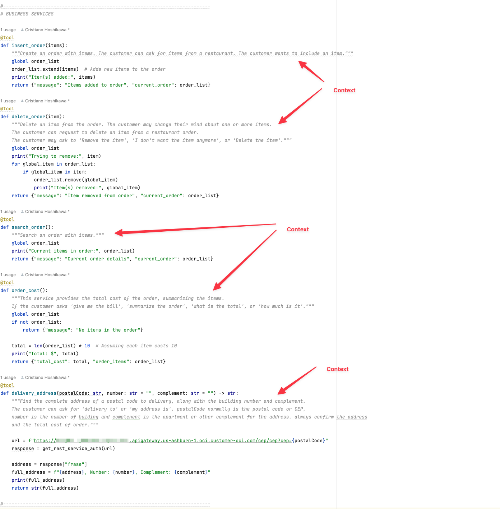
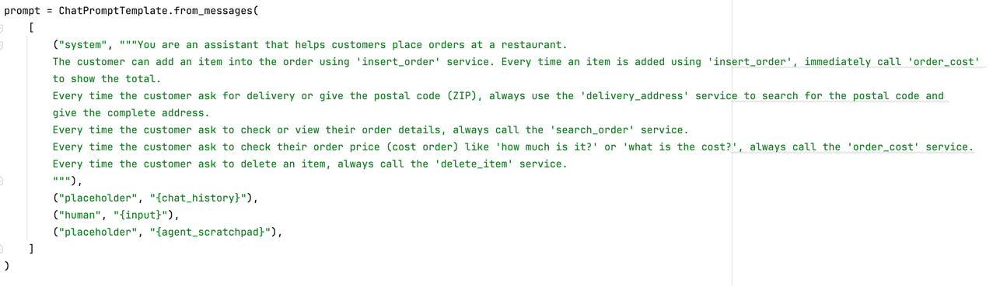
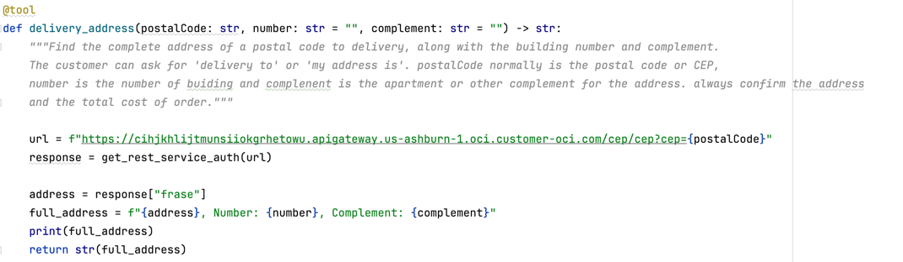
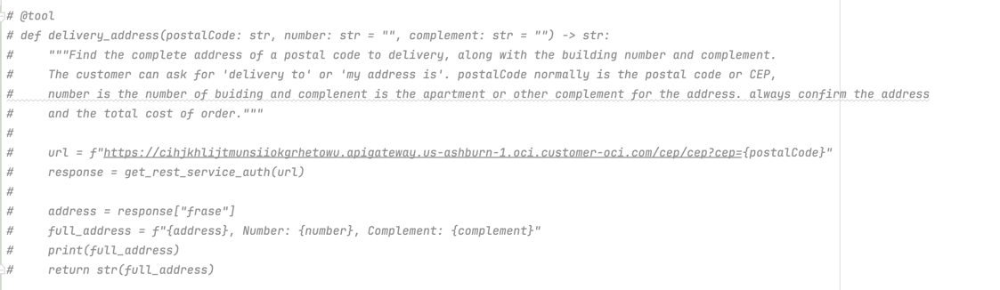
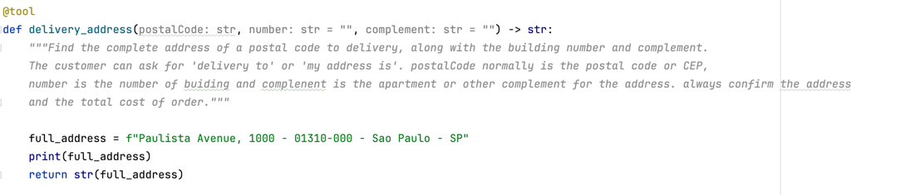
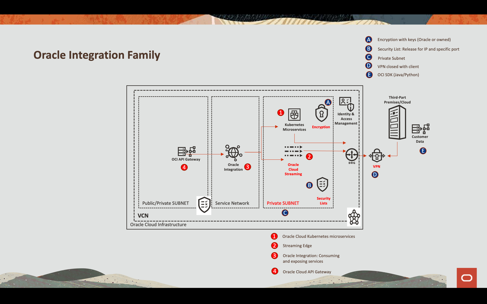
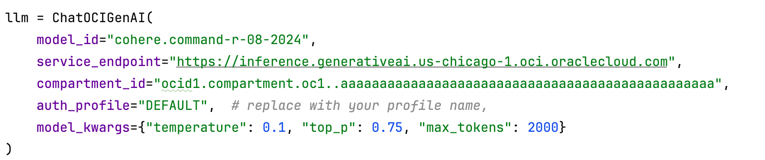
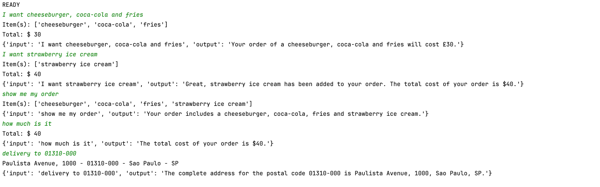

# Develop an Agent AI with Oracle Cloud Generative AI

## Introduction

The use of Large Language Models (LLM) has revolutionized the way we interact with systems and business processes. With the ability to understand natural language and integrate with legacy services, these models make applications more intelligent and efficient.

This material aims to demonstrate, through a practical example, how LLM concepts can be applied to optimize integrations with legacy systems. By using AI Agents, it is possible to significantly reduce the complexity of API consumption, making process automation more flexible and accessible.

Throughout the document, common scenarios will be presented where the application of AI Agents can simplify business operations, reducing the need for manual configurations and facilitating communication between different systems.

## Summary

- Use LLM models to understand business processes and direct execution for legacy services
- Understanding is possible through the inclusion of context, which greatly facilitates and speeds up the construction of applications
- LLM models use natural language, including translation into several other languages

## About the Demo

- Although simple, the following demo will show how to build a simple application based on a legacy
- When there is a legacy of APIs, the use of AI Agents allows for powerful integrations
- Applying LLM concepts to AI Agents often allows for solving complex API consumption problems. Without AI, an API requires a lot of work for integration, as it involves knowing all the input and output attributes

## Understand the code

You can find and test the code here: [agent_ocigenai.py](./source/agent_ocigenai.py)

The code is divided in 4 modules:

**Service Definition**: The code defines several services, such as insert_order, delete_order, search_order, order_cost, and delivery_address. These services are decorated with the @tool decorator, which indicates that they can be called by the conversational agent.

**Language Model Definition**: The code uses the Oracle Cloud Infrastructure (OCI) ChatOCIGenAI language model to generate responses to user questions.

**Conversational Agent Definition**: The code creates a conversational agent using LangChain's create_tool_calling_agent function, passing as parameters the language model, the defined services and a prompt template.

**Conversational Loop**: The code enters an infinite loop, where it waits for user input and processes the responses using the conversational agent.

### REST SERVICES

Here are the services defined for the REST calls. For the example of fetching the address from the zip code, a call is being made to the OCI API Gateway which exposes an integration built in Oracle Integration to get the address from a microservice on Oracle Kubernetes Engine (OKE).

### BUSINESS SERVICES

When implementing business services, it is possible to expose these services so that Generative AI can better explore each of them. This is possible through a library called langchain.tools, which is capable of interpreting a given context in natural language and associating it with a specific business service. When declaring the services that will be part of the business logic, it is possible to declare "aliases" in the docstrings of each of them to help contextualize them.

As well as the context declaration is necessary in the prompt to use the AI model.

Note that in each service definition, it is possible to determine a specific context so that, when sending a request in natural language, the library can interpret what was requested and determine which appropriate service should be executed.

The langchain.tools library understands the scope of work by associating the contexts and services available for use. This is done by the following declaration:

Another interesting point about the langchain.tools library is that the service signature attributes are also interpreted, that is, the library itself determines how to forward the request in natural language and define the attributes of the parameters of the service in question. This is already very impressive in itself, as it greatly reduces the implementation burden on integrations. In the traditional integration model, there is time to be spent defining the FROM-TO between the source and destination of these integrations. This is a very reasonable effort. In the Agent AI model, it is through the context that the attributes are passed, that is, the library can determine what each parameter is and pass it to the service in the correct way.

### Test the Code

You can test and adjust the code for your purposes. The service named "delivery_address" was implemented calling a REST API. In this example, you can test the code change the real REST request to a fake request. To do this, comment the real code:

To comment the code, just put the "#" into the lines:

And discomment this code:

You can integrate you own API. Using the Oracle Cloud resources, you can use:

- **Oracle Cloud API Gateway**
- **Oracle Integration**
- **Oracle Cloud Kubernetes Engine**
- **Oracle Cloud Streaming**

And you can integrate with on-premises or other cloud resources.

### Configure the code

This python code needs some libraries. So you need to download the [requirements.txt](./source/requirements.txt) file. This file contains the libraries.
Run this code to install the libraries in your terminal:

    pip install -r requirements.txt

You need to configure the OCI-CLI and link with your tenancy. You can install and configure following this material: [Installing the OCI-CLI](https://docs.oracle.com/en-us/iaas/Content/API/SDKDocs/cliinstall.htm)

After install the libraries and the OCI-CLI, you need to configure a compartment to store your resources for the Generative AI. Please, change the compartment_id. Maintain the auth_profile with DEFAULT.

### Run the code

You can run the code executing this command on your terminal:

    python agent_ocigenai.py

## Scenarios for Agent AI

There are several scenarios for integrations with multiple REST APIs and the use of AGENT AI. The complexities between mapping business information and available APIs are many. This is very common in several corporate business situations. Here are some examples where an AGENT AI can facilitate this task:

1. **Financial Process Automation (ERP & Banks)**
   - **Scenario:** Companies need to integrate with multiple banks to obtain statements, generate payment slips, process payments and validate tax information.
   - **Challenges:** Each bank has its own API, with specific parameters for payments, PIX, transfers and financial reconciliation.
   - **How Agent AI helps:** It can interpret requests such as “Pay the invoice for supplier X” and redirect to the correct bank API with the required parameters.

2. **Order Management and Logistics (E-commerce, ERP, WMS)**
   - **Scenario:** An e-commerce needs to orchestrate orders, update inventories and request carriers for different types of delivery.
   - **Challenges:** Carrier APIs vary (Post Office, FedEx, DHL, local carriers), requiring specific request formats.
   - **How Agent AI helps:** It can translate requests like “Ship this order via the cheapest carrier” and automatically select the right service.

3. **Customer Service & Helpdesk**
   - **Scenario:** Companies with CRMs like Siebel, Oracle CX, ServiceNow need to integrate customer requests with different APIs.
   - **Challenges:** Each system has different endpoints for creating tickets, updating statuses, retrieving customer information, and tracking history.
   - **How Agent AI helps:** It can understand requests like “Show me the last calls from customer X” and call the correct CRM API.

4. **HR and Payroll Integration**
   - **Scenario:** HR systems need to synchronize payroll, benefits, and onboarding across multiple vendors and ERPs.
   - **Challenges:** Benefits, payroll, and talent management APIs have different regulatory parameters and validations.
   - **How Agent AI helps:** It can interpret commands like “Admit new employee to payroll” and translate that into appropriate calls to the right APIs.

5. **Infrastructure and Security Monitoring (SIEM & ITSM)**
   - **Scenario:** Large enterprises use multiple monitoring systems (Splunk, Datadog, ServiceNow, Zabbix) to track incidents and anomalies.
   - **Challenges:** Each tool has a different API for alerts, logs, and automated responses.
   - **How Agent AI helps:** It can interpret commands like “List the latest critical alerts and open a ticket in ServiceNow.”

6. **Contract Management and Digital Signatures**
   - **Scenario:** Companies use services like DocuSign and Adobe Sign to manage contracts and signatures.
   - **Challenges:** Each service has different requirements for sending documents, validating signatures, and tracking status.
   - **How Agent AI helps:** It might receive a request like “Send this contract to client X for signature and notify me when it’s signed,” and direct it to the correct API.

7. **Healthcare Management and Electronic Medical Records (HIS, PACS, LIS, ERP)**
   - **Scenario:** Hospitals and clinics use different systems to store patient information, lab tests, and medical images.
   - **Challenges:** APIs from systems such as Tasy (Philips), MV, Epic, and PACS (DICOM image files) have different request formats.
   - **How Agent AI helps:** It can interpret commands such as “Retrieve patient John Smith’s latest blood test and attach it to the medical record,” automatically calling the right APIs.

8. **Telecommunications (Technical Support and Service Provisioning)**
   - **Scenario:** Telecommunications operators offer telephone, internet and TV services, and need to integrate multiple billing, CRM and network monitoring systems.
   - **Challenges:** Each operation (e.g.: opening calls, changing plans, checking consumption) involves different APIs specific to each service.
   - **How Agent AI helps:** It can understand “I want to increase my internet allowance to 500 MB” and trigger the correct API to upgrade the plan.

9. **Insurance Automation (Claims and Policy Issuance)**
   - **Scenario:** Insurance companies need to integrate APIs for quoting, policy issuance, and claims.
   - **Challenges:** Each insurance company has its own API, and the parameters vary depending on the type of insurance (vehicle, health, home).
   - **How Agent AI helps:** It can translate a request like “Register a claim for customer Pedro Souza’s car, with a side impact” into automatic calls to the right APIs.

10. **Foreign Trade and Customs Clearance**
    - **Scenario:** Companies that import/export need to deal with IRS APIs, international carriers, and customs control systems.
    - **Challenges:** Each country has different rules and formats for documentation (DU-E, DI, Invoice, Packing List).
    - **How Agent AI helps:** It can interpret “Track the release of cargo X at the port of Santos” and translate this into requests in the IRS and carriers API.

11. **Hotel Management and Online Booking**
    - **Scenario:** Hotels need to integrate with platforms like Booking, Expedia, and Airbnb to manage reservations and room availability.
    - **Challenges:** Each platform has different rules for cancellations, rate adjustments, and response times.
    - **How Agent AI helps:** It can understand “Adjust the rate to R$400 on Friday and block reservations for Monday” and call the correct APIs.

12. **Marketing Automation and Advertising Campaigns**
    - **Scenario:** Companies use tools such as Meta Ads, Google Ads, HubSpot and RD Station for digital campaigns.
    - **Challenges:** Creating campaigns, segmenting audiences and analyzing metrics requires integration with multiple APIs.
    - **How Agent AI helps:** It can interpret “Create an ad on Facebook for the 25 to 40 year old audience interested in technology, with a budget of R$500” and configure the campaign automatically.

13. **Supply Chain and Inventory Management**
    - **Scenario:** Large retail chains need to monitor inventory in real time and predict automatic replenishment.
    - **Challenges:** ERP, WMS, and supplier systems have separate APIs for product requisition and demand forecasting.
    - **How Agent AI helps:** It can understand “Replenish product X when it reaches 10 units” and trigger the right APIs.

14. **Integration of Chatbots and Omnichannel Service**
    - **Scenario:** Companies offer support via WhatsApp, Telegram, email and chatbot, needing to centralize everything in the CRM.
    - **Challenges:** Different APIs for each channel, with different rules for automatic responses and routing.
    - **How Agent AI helps:** It can interpret “Forward this payment question to a human attendant” and redirect to the correct channel.

15. **Energy Management and IoT (Smart Grid)**
    - **Scenario:** Electric power companies use APIs to measure consumption, forecast demand and preventative maintenance.
    - **Challenges:** IoT systems, sensors and energy distributors have different and regulated APIs.
    - **How Agent AI helps:** It can understand “Monitor the consumption of factory X and notify me if it exceeds 100 kWh” and configure automatic alerts.

## Conclusions

The adoption of AI Agents powered by LLMs has demonstrated enormous potential to streamline integration with legacy systems. By interpreting natural language commands and translating requests into accurate API calls, these agents significantly reduce the complexity of automating business processes.

The examples presented here demonstrate how this approach can be applied to a variety of industries, from finance and logistics to customer service and infrastructure monitoring. The ability of AI agents to dynamically adapt to different services and contexts provides a new level of flexibility and efficiency in the digital transformation of companies.

As AI models continue to evolve, these integrations are expected to become even more intelligent, enabling increasingly natural and accurate interactions between users and systems. The future of automation involves the combination of artificial intelligence and APIs, and AI Agents are the key to this new era of digital connectivity.

## References

- [About the Chat Models in Generative AI](https://docs.oracle.com/en-us/iaas/Content/generative-ai/chat-models.htm)
- [Installing the OCI-CLI](https://docs.oracle.com/en-us/iaas/Content/API/SDKDocs/cliinstall.htm)

## Acknowledgments

- **Author** - Cristiano Hoshikawa (Oracle LAD A-Team Solution Engineer)

